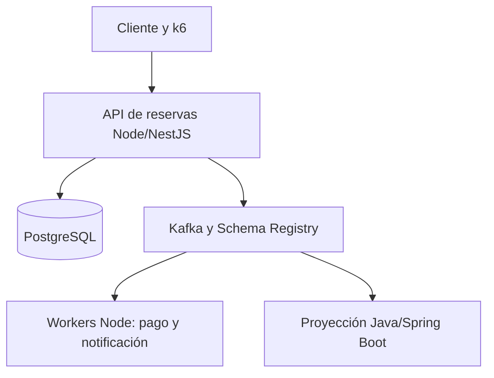

# Plan de estudio: Java/Spring Boot + TypeScript/Node.js + Kafka + sistemas distribuidos + arquitectura + liderazgo técnico

> **Estado del documento:** [Inferencia] Itinerario recomendado a partir del perfil, disponibilidad y objetivo indicados por Iván. La existencia, versión y temario de los recursos enlazados se verificaron el 17 de agosto de 2026. Las duraciones de aprendizaje, el orden pedagógico y el valor curricular esperado son estimaciones razonadas, no certezas.

## 1. Restricciones y objetivo

- Perfil inicial: Senior Backend Engineer especializado en Java/Spring Boot, Kafka y sistemas distribuidos.
- Experiencia inicial en JavaScript, TypeScript y Node.js: prácticamente ninguna.
- Dedicación sostenible: 3–4 horas semanales.
- Prioridad: profundidad, sin fecha límite rígida.
- Objetivo principal: mejorar el CV manteniendo el puesto actual.
- Evidencia: un proyecto público y completo; no se dedicarán horas específicas a certificaciones, artículos o charlas.
- Foco: Node.js y TypeScript. Java, Kafka, arquitectura, sistemas distribuidos y liderazgo actúan como elementos integradores.

## 2. Resultado esperado

[Inferencia] El itinerario base dura **72 semanas**, unas **252 horas** a un ritmo medio de 3,5 horas semanales. Si una semana no se puede completar, se desplaza el calendario: no se recupera duplicando carga.

Al terminar deberías poder:

1. Explicar el modelo de ejecución de JavaScript y Node.js sin compararlo de manera superficial con los threads de Java.
2. Diseñar TypeScript estricto, diferenciando seguridad estática y validación en runtime.
3. Crear y operar una API Node.js/NestJS con PostgreSQL, pruebas, seguridad y observabilidad.
4. Diagnosticar bloqueos del event loop, presión de memoria, backpressure y tareas CPU-bound.
5. Producir y consumir eventos Kafka desde Node.js y Java, con contratos versionados.
6. Implementar idempotencia, outbox/inbox, reintentos, DLQ, expiración y compensaciones.
7. Justificar cuándo mantener un monolito modular y cuándo extraer un servicio.
8. Diseñar SLO, pruebas de carga y experimentos de fallo.
9. Desplegar contenedores en AWS mediante CI/CD e infraestructura como código.
10. Defender decisiones técnicas con contexto, alternativas, consecuencias y estrategia de reversión.

El posicionamiento curricular final buscado es:

> Senior Backend / Distributed Systems Engineer con experiencia principal en Java/Spring Boot y capacidad demostrable para diseñar y construir servicios de producción con TypeScript/Node.js.

## 3. Proyecto conductor: SeatFlow

### 3.1 Elección del dominio

[Inferencia] El mejor dominio para mostrar tu combinación de competencias es una **plataforma de reserva temporal de entradas bajo alta concurrencia**.

El sistema permitirá:

- publicar eventos y sesiones con aforo limitado;
- bloquear entre 1 y 8 plazas durante 8 minutos;
- confirmar o cancelar una reserva;
- expirar bloqueos y devolver plazas;
- simular un pago externo;
- consultar disponibilidad y estado;
- generar notificaciones y una proyección analítica;
- soportar reintentos del cliente sin duplicar reservas ni cobros;
- demostrar el comportamiento ante un pico concentrado sobre una única sesión.

Este dominio hace visibles problemas relevantes para un backend senior: contención, consistencia, transacciones, estados temporales, idempotencia, particionado Kafka, eventos, fallos parciales, observabilidad y rendimiento.

### 3.2 Evolución arquitectónica deliberada

| Etapa | Arquitectura                         | Razón de aprendizaje                                           |
| ----- | ------------------------------------ | -------------------------------------------------------------- |
| 1     | Librería de dominio TypeScript       | Aprender el lenguaje sin ocultarlo bajo un framework           |
| 2     | API HTTP mínima sobre Node.js        | Comprender runtime, HTTP, errores, streams y ciclo de vida     |
| 3     | Monolito modular NestJS + PostgreSQL | Construir un backend mantenible sin distribución prematura     |
| 4     | Outbox + Kafka + workers Node.js     | Añadir asincronía y entrega al menos una vez                   |
| 5     | Proyección Java/Spring Boot          | Probar interoperabilidad y evolución de contratos              |
| 6     | Extraer pago/notificaciones          | Practicar fronteras y compensación donde existe una razón real |
| 7     | AWS + observabilidad + carga         | Completar operación, automatización y evidencia curricular     |

### 3.3 Arquitectura final orientativa



Redis se incorporará únicamente para rate limiting, caché o coordinación que pueda perderse y reconstruirse. PostgreSQL seguirá siendo la autoridad para aforo y reservas.

### 3.4 Stack final

- Node.js 24 LTS al comenzar; revisión de la LTS activa en cada hito mayor.
- TypeScript en modo `strict`.
- NestJS para el backend principal.
- PostgreSQL y TypeORM, usando SQL explícito en el camino crítico cuando sea necesario.
- Redis para rate limiting/caché, no como fuente de verdad del inventario.
- KafkaJS mediante la integración de NestJS.
- Avro + Schema Registry para contratos Node/Java.
- Java 25 LTS + Spring Boot 4.1 para una proyección de lectura/analítica y la comparación explícita Spring Kafka/KafkaJS.
- Jest, Supertest y Testcontainers para pruebas.
- k6 para carga, estrés y picos.
- OpenTelemetry para trazas y métricas; logs JSON correlacionados.
- Docker Compose local.
- GitHub Actions, Terraform, AWS ECS/Fargate y RDS en el tramo final.
- Confluent Cloud para Kafka durante el despliegue final o MSK durante una prueba temporal controlada.

### 3.5 Estructura aproximada del repositorio

```text
seatflow/
  apps/
    reservation-api/        # NestJS
    payment-worker/         # Node.js
    notification-worker/    # Node.js
    analytics-projection/   # Java/Spring Boot
  packages/
    domain/
    contracts/
    observability/
    test-support/
  infra/
    docker/
    terraform/
  load-tests/
  docs/
  .github/workflows/
```

No se añadirá frontend, Kubernetes, GraphQL, MongoDB, RabbitMQ ni otro framework JavaScript salvo que un requisito real del proyecto lo justifique.

## 4. Rutina semanal

### Semana normal de 3 horas y 45 minutos

| Bloque | Duración | Actividad                                                                   |
| ------ | -------: | --------------------------------------------------------------------------- |
| A      |   75 min | Curso guiado, resolviendo los ejercicios sin copiar la solución             |
| B      |   90 min | Implementación en SeatFlow                                                  |
| C      |   45 min | Documentación oficial o lectura asignada                                    |
| D      |   15 min | Recuperación activa: explicar sin apuntes, registrar dudas y siguiente paso |

Si esa semana solo dispones de 3 horas, conserva íntegro el bloque de implementación y reduce lectura o vídeo. Cada cuarta semana, el bloque de curso se reemplaza por consolidación o un caso de liderazgo.

### Regla de aprendizaje

Para considerar dominado un concepto debes poder completar las cuatro acciones:

1. **Explicarlo** sin apuntes.
2. **Implementarlo** sin seguir un tutorial línea a línea.
3. **Romperlo y observarlo** con una prueba o fallo inducido.
4. **Defenderlo** frente a una alternativa, mencionando costes y límites.

## 5. Mapa general de 72 semanas

| Fase                                         | Semanas | Horas estimadas | Resultado principal                                    |
| -------------------------------------------- | ------: | --------------: | ------------------------------------------------------ |
| 0. Preparación                               |     1–2 |               7 | Entorno, repositorio y baseline                        |
| 1. JavaScript profundo                       |    3–10 |              28 | Modelo mental del lenguaje y asincronía                |
| 2. TypeScript profesional                    |   11–18 |              28 | Dominio tipado y estado exhaustivo                     |
| 3. Plataforma Node.js                        |   19–28 |              35 | API sin depender todavía de NestJS                     |
| 4. NestJS + PostgreSQL                       |   29–40 |              42 | Monolito modular transaccional y probado               |
| 5. Kafka y arquitectura dirigida por eventos |   41–50 |              35 | Outbox, consumidores idempotentes y contrato Node/Java |
| 6. Sistemas distribuidos y fiabilidad        |   51–60 |              35 | Sagas, SLO, observabilidad y experimentos de fallo     |
| 7. AWS, CI/CD y seguridad                    |   61–68 |              28 | Despliegue reproducible mediante Terraform             |
| 8. Endurecimiento y presentación curricular  |   69–72 |              14 | Versión 1.0 medible y defendible                       |
| **Total**                                    |  **72** |         **252** | Proyecto público completo                              |

## 6. Plan quincenal completo

Cada fila representa aproximadamente siete horas. Las fechas se calculan desde la semana real de inicio.

| Semanas | Estudio                                                           | Trabajo en el proyecto                                  | Comprobación                                                 |
| ------- | ----------------------------------------------------------------- | ------------------------------------------------------- | ------------------------------------------------------------ |
| 1–2     | Node LTS, npm/pnpm, ESM, Git, TypeScript tooling                  | Crear repositorio, CI mínima y esqueleto de paquetes    | Instalación reproducible y primer pipeline verde             |
| 3–4     | Valores, funciones, scopes y execution contexts                   | Katas de dominio sin clases ni framework                | Explicar stack, heap, scope y coerción                       |
| 5–6     | Higher-order functions, closures, objetos y prototipos            | Repositorio en memoria y reglas de reserva              | Implementar una closure útil y explicar prototipos           |
| 7–8     | Call stack, callbacks, promises, tasks y microtasks               | Simulador de expiraciones y concurrencia asíncrona      | Predecir el orden de ejecución antes de correr el código     |
| 9–10    | `async/await`, propagación de errores, ESM y limpieza             | Miniaplicación CLI de reservas                          | Sin promesas huérfanas; pruebas del flujo completo           |
| 11–12   | Inferencia, tipos estructurales, uniones e interfaces             | Migrar el dominio a TypeScript estricto                 | Compilación con configuración estricta                       |
| 13–14   | Narrowing, discriminated unions, `never`, genéricos               | Máquina de estados de Reservation                       | Transiciones ilegales imposibles o rechazadas en el límite   |
| 15–16   | Utility, mapped y conditional types; branded IDs                  | Tipar IDs, comandos, eventos y resultados               | Sin confundir IDs de dominios distintos                      |
| 17–18   | ESM/CJS, `tsconfig`, tipos externos y validación runtime          | Validar comandos/eventos con Zod o equivalente          | Diferenciar claramente tipo estático y dato no confiable     |
| 19–20   | Runtime Node, módulos, `process`, npm, filesystem                 | CLI y configuración real                                | Shutdown y errores de proceso controlados                    |
| 21–22   | Event loop, libuv, timers, `AbortController`, `AsyncLocalStorage` | Deadlines, cancelación y correlation ID                 | Demostrar un bloqueo del event loop y corregirlo             |
| 23–24   | Streams, backpressure, EventEmitter y worker threads              | Importador de sesiones en streaming                     | Memoria estable con fichero grande; CPU-bound fuera del loop |
| 25–26   | HTTP nativo y Express; REST, errores y validación                 | Primera API HTTP de SeatFlow                            | Contrato OpenAPI inicial y errores consistentes              |
| 27–28   | Pool PostgreSQL, logging, perfiles y pruebas Node                 | Persistencia sencilla y graceful shutdown               | Prueba e2e y perfil de una ruta lenta                        |
| 29–30   | Nest: módulos, providers, controllers y DI                        | Migrar API al monolito modular NestJS                   | Límites de módulo visibles; dominio no depende de Nest       |
| 31–32   | Pipes, guards, filters, interceptors, config y OpenAPI            | Validación, auth mínima y error model                   | Entradas no válidas rechazadas y documentadas                |
| 33–34   | PostgreSQL, TypeORM, migraciones, índices y planes                | Modelo de eventos, sesiones, reservas y outbox vacío    | Base recreable solo con migraciones                          |
| 35–36   | Aislamiento, locks, atomic updates y contención                   | Reserva sin overselling bajo concurrencia               | Prueba concurrente repetible con invariantes                 |
| 37–38   | Idempotency keys, expiración y `SKIP LOCKED`                      | Confirmar, cancelar y expirar reservas                  | Repetir peticiones no duplica efectos                        |
| 39–40   | Unit, integration, e2e, Testcontainers y k6                       | Suite completa y primer perfil de carga                 | Hito v0.4: API estable, testeada y medible                   |
| 41–42   | Kafka: log, topics, partitions, groups, offsets y entrega         | Entorno local Kafka/Schema Registry                     | Explicar orden, rebalances y límites de paralelismo          |
| 43–44   | KafkaJS/Nest, producer/consumer, claves y commits                 | Publicación y consumo básico                            | Selección de key justificada y lag observable                |
| 45–46   | Transactional outbox, inbox, retries, DLQ                         | Relay de outbox y consumer idempotente                  | Caídas entre DB/Kafka no pierden el evento lógico            |
| 47–48   | Avro, compatibilidad y evolución de esquema                       | Contratos y proyección Java/Spring Boot                 | Node y Java intercambian dos versiones compatibles           |
| 49–50   | Backpressure, lag, poison messages y particiones calientes        | Pruebas de fallo y recuperación del consumidor          | Hito v0.6: reinicio seguro y replay documentado              |
| 51–52   | NFR, estimación de carga, CAP y consistencia                      | Definir SLO y modelo de carga                           | Requisitos cuantificados, no adjetivos vagos                 |
| 53–54   | Cohesión, acoplamiento y fronteras de servicio                    | Decidir qué extraer y qué mantener junto                | Decisión defendida frente a dos alternativas                 |
| 55–56   | Saga, compensación y timeouts                                     | Servicio de pago simulado y checkout distribuido        | Cada fallo parcial termina en un estado explicable           |
| 57–58   | Timeout, retry, jitter, circuit breaker y bulkhead                | Políticas distintas por dependencia                     | Evitar tormentas de reintentos en una prueba inducida        |
| 59–60   | OpenTelemetry, SLI/SLO, trazas Kafka y caos                       | Trazas Node→Kafka→Java y fallo con Toxiproxy            | Hito v0.8: localizar una degradación usando telemetría       |
| 61–62   | Docker seguro, CI, supply chain y GitHub Actions                  | Imágenes multistage, SBOM/scan y pipeline completo      | Build reproducible sin secretos embebidos                    |
| 63–64   | Terraform, IAM y AWS App Runner/ECS                               | Infraestructura inicial y entorno efímero               | Crear y destruir el entorno desde código                     |
| 65–66   | RDS, red, secretos, OIDC y Kafka administrado                     | Persistencia, despliegue y migraciones                  | Despliegue desde CI sin credenciales AWS duraderas           |
| 67–68   | Coste, escalado, rollback y prueba remota                         | Ejecutar smoke/load test y destruir recursos caros      | Hito v0.9: informe con coste y límites observados            |
| 69–70   | OWASP API/Node, profiling y revisión arquitectónica               | Hardening, índices, dependencias y deuda crítica        | Sin vulnerabilidades altas conocidas ni regresión medible    |
| 71–72   | Síntesis y explicación técnica                                    | README, diagramas mínimos, demo reproducible y tag v1.0 | Un tercero puede levantar, probar y entender el sistema      |

## 7. Detalle por fases y recursos

### Fase 0 — Preparación (semanas 1–2)

#### Recursos obligatorios

- [Versiones oficiales de Node.js](https://nodejs.org/en/about/previous-releases). El 17-08-2026, Node 24 figura como LTS y Node 26 como Current; para producción se recomienda una rama LTS.
- [Introducción oficial a Node.js](https://nodejs.org/en/learn/getting-started/introduction-to-nodejs).
- [GitHub Actions: construir y probar Node.js](https://docs.github.com/actions/guides/building-and-testing-nodejs).

#### Configuración

- Node 24 LTS mediante un gestor de versiones.
- `pnpm`, workspaces, lockfile comprometido.
- TypeScript `strict`, ESLint, Prettier y EditorConfig.
- Scripts únicos: `format`, `lint`, `typecheck`, `test`, `build`.
- CI desde el primer commit.

#### Puerta de salida

Clonar el repositorio en un directorio limpio y obtener un pipeline verde siguiendo únicamente el README inicial.

### Fase 1 — JavaScript profundo (semanas 3–10)

#### Curso principal

- [JavaScript: The Hard Parts, v3](https://frontendmasters.com/courses/javascript-hard-parts-v3/) — publicado en enero de 2026, unas 9,7 horas. Verlo con ejercicios; no reproducirlo pasivamente.

#### Documentación

- [Guía de JavaScript de MDN](https://developer.mozilla.org/en-US/docs/Web/JavaScript/Guide).
- [Closures](https://developer.mozilla.org/en-US/docs/Web/JavaScript/Guide/Closures).
- [Cadena de prototipos](https://developer.mozilla.org/en-US/docs/Web/JavaScript/Guide/Inheritance_and_the_prototype_chain).
- [Modelo de ejecución](https://developer.mozilla.org/en-US/docs/Web/JavaScript/Reference/Execution_model).
- [Promises y async/await](https://javascript.info/async).
- [Módulos JavaScript](https://developer.mozilla.org/en-US/docs/Web/JavaScript/Guide/Modules).

#### Contenidos que no se pueden saltar por venir de Java

- `this` dinámico frente a arrow functions.
- closures y estado léxico;
- prototipos frente a clases sintácticas;
- truthiness, igualdad y coerción;
- mutabilidad de objetos y referencias;
- tasks, microtasks y ejecución run-to-completion;
- promesas, errores y cancelación cooperativa;
- ESM frente a CommonJS.

#### Puerta de salida

Resolver cinco trazas de ejecución asíncrona sin ejecutar el código, implementar un pool de promesas con límite de concurrencia y explicar por qué concurrencia asíncrona no equivale a paralelismo de CPU.

### Fase 2 — TypeScript profesional (semanas 11–18)

#### Cursos

- [TypeScript 5+ Fundamentals, v4](https://frontendmasters.com/courses/typescript-v4/).
- [Intermediate TypeScript, v2](https://frontendmasters.com/courses/intermediate-typescript-v2/) — seleccionar módulos, tipos extremos, generics, conditional y mapped types.

#### Documentación

- [TypeScript Handbook](https://www.typescriptlang.org/docs/handbook/intro.html).
- [Narrowing](https://www.typescriptlang.org/docs/handbook/2/narrowing.html).
- [Generics](https://www.typescriptlang.org/docs/handbook/2/generics.html).
- [Utility Types](https://www.typescriptlang.org/docs/handbook/utility-types.html).
- [Compatibilidad estructural](https://www.typescriptlang.org/docs/handbook/type-compatibility.html).

#### Aplicación al proyecto

- `Reservation` como unión discriminada de estados.
- IDs nominales simulados mediante branded types.
- `Result` solo donde haga explícita una alternativa de negocio; no replicar excepciones Java mecánicamente.
- validación runtime en cada entrada externa;
- `noUncheckedIndexedAccess`, `exactOptionalPropertyTypes` y política explícita de `unknown`/`any`.

#### Puerta de salida

El dominio compila en modo estricto, tiene tests de transiciones y usa un `assertNever` para detectar estados no tratados. Ningún dato HTTP/Kafka se considera seguro solo porque tenga una interfaz TypeScript.

### Fase 3 — Plataforma Node.js (semanas 19–28)

#### Cursos

- [Introduction to Node.js, v3](https://frontendmasters.com/courses/node-js-v3/) — 4 h 12 min.
- [API Design in Node.js, v5](https://frontendmasters.com/courses/api-design-nodejs-v5/) — publicado en septiembre de 2025; Express, PostgreSQL, Zod, JWT, pruebas y despliegue.

#### Documentación oficial prioritaria

- [Event loop de Node.js](https://nodejs.org/en/learn/asynchronous-work/event-loop-timers-and-nexttick).
- [No bloquear el event loop ni el worker pool](https://nodejs.org/en/learn/asynchronous-work/dont-block-the-event-loop).
- [Streams y backpressure](https://nodejs.org/en/learn/modules/backpressuring-in-streams).
- Secciones oficiales de diagnóstico, memoria, profiling y test runner dentro de [Node.js Learn](https://nodejs.org/en/learn/).

#### Libro de consulta

- [Node.js Design Patterns, 4.ª edición](https://www.packtpub.com/en-us/product/nodejs-design-patterns-9781803238944) — publicado en septiembre de 2025. Lectura asignada: capítulos 1, 2, 5, 6, 10 y 11. Los capítulos 12–13 se reservan para las fases distribuidas.

#### Puerta de salida

API HTTP ejecutable sin NestJS, con cancelación, timeouts, structured logging, correlation ID, graceful shutdown y una prueba que muestre el impacto de una operación CPU-bound antes y después de moverla a un worker.

### Fase 4 — NestJS y PostgreSQL (semanas 29–40)

#### Curso

- [Curso oficial NestJS Fundamentals](https://courses.nestjs.com/) — 80 lecciones y unas cinco horas, con actualizaciones del equipo de Nest.

No se compra todavía el curso de microservicios: primero se termina el monolito modular y se estudia Kafka desde sus fundamentos.

#### Documentación NestJS

- [Documentación principal](https://docs.nestjs.com/).
- [Testing](https://docs.nestjs.com/fundamentals/testing).
- [Validación](https://docs.nestjs.com/techniques/validation).
- [Base de datos](https://docs.nestjs.com/techniques/database).
- [OpenAPI](https://docs.nestjs.com/openapi/introduction).
- [Autenticación](https://docs.nestjs.com/security/authentication).
- [Health checks](https://docs.nestjs.com/recipes/terminus).

#### Pruebas y seguridad

- [Testcontainers para Node.js](https://node.testcontainers.org/), incluyendo módulos de [PostgreSQL](https://node.testcontainers.org/modules/postgresql/) y posteriormente Kafka.
- [OWASP Node.js Security Cheat Sheet](https://cheatsheetseries.owasp.org/cheatsheets/Nodejs_Security_Cheat_Sheet.html).
- [OWASP API Security Top 10](https://owasp.org/API-Security/editions/2023/en/0x11-t10/).

#### Decisiones técnicas obligatorias

- Comparar actualización atómica, lock pesimista y serialización optimista para el aforo.
- Probar al menos dos estrategias antes de seleccionar una.
- Mantener la invariancia `0 <= available_capacity <= capacity` bajo concurrencia.
- Expirar reservas en lotes seguros para múltiples instancias.
- Implementar idempotency keys almacenadas y respuestas repetibles.
- Analizar índices con `EXPLAIN (ANALYZE, BUFFERS)`.

#### Puerta de salida

Una prueba concurrente repetible no genera overselling; confirmación, cancelación y expiración son idempotentes; la base se recrea mediante migraciones; unit, integration y e2e pasan en CI.

### Fase 5 — Kafka y eventos (semanas 41–50)

#### Cursos gratuitos

- [Confluent Developer: catálogo de cursos](https://developer.confluent.io/courses/).
- Obligatorio: [Apache Kafka 101](https://developer.confluent.io/courses/apache-kafka/events/).
- Obligatorio: [Kafka Architecture Deep Dive](https://developer.confluent.io/courses/architecture/get-started/).
- Selectivo: [Kafka Security](https://developer.confluent.io/courses/security/intro/).

#### Documentación

- [Documentación oficial de Apache Kafka](https://kafka.apache.org/documentation/).
- [NestJS Kafka transporter](https://docs.nestjs.com/microservices/kafka).
- [KafkaJS: producción](https://kafka.js.org/docs/producing), [consumo](https://kafka.js.org/docs/consuming) y [transacciones](https://kafka.js.org/docs/transactions).
- [Schema Registry](https://docs.confluent.io/platform/current/schema-registry/index.html) y [evolución de esquemas](https://docs.confluent.io/platform/current/schema-registry/fundamentals/schema-evolution.html).
- [Curso gratuito de Spring for Apache Kafka](https://developer.confluent.io/courses/spring/apache-kafka-intro/) para contrastar las abstracciones Java y Node.
- [Java SE Support Roadmap](https://www.oracle.com/java/technologies/java-se-support-roadmap.html), donde Java 25 figura como LTS, y anuncio oficial de [Spring Boot 4.1.0](https://spring.io/blog/2026/06/10/spring-boot-4).

#### DDIA 2.ª edición

- Capítulo 5: Encoding and Evolution.
- Capítulo 8: Transactions.
- Capítulo 12: Stream Processing.

La [segunda edición de Designing Data-Intensive Applications](https://www.oreilly.com/library/view/designing-data-intensive-applications/9781098119058/) fue publicada en febrero de 2026.

#### Implementaciones obligatorias

- Outbox en la misma transacción que la reserva.
- Relay reintentable y observable.
- Inbox o tabla de deduplicación en consumidores con efecto externo.
- DLQ con causa, payload identificable y procedimiento de replay.
- Key de partición elegida a partir del requisito de orden.
- Proyección analítica en Java 25/Spring Boot 4.1, con tests de integración y comparación documentada entre Spring Kafka y KafkaJS.
- Avro compatible entre productor Node y consumidor Java.
- Métricas de lag, throughput, errores y tiempo de procesamiento.

#### Puerta de salida

Detener el proceso en distintos puntos entre escritura, publicación, consumo y commit; al reiniciar, el estado converge sin perder el evento lógico ni duplicar el efecto de negocio.

### Fase 6 — Sistemas distribuidos, arquitectura y fiabilidad (semanas 51–60)

#### Cursos y libros

- [Backend System Design](https://frontendmasters.com/courses/backend-system-design/) — publicado en diciembre de 2025, 7 h 17 min.
- [Fundamentals of Software Architecture, 2.ª edición](https://www.oreilly.com/library/view/fundamentals-of-software/9781098175504/) — leer las secciones de características arquitectónicas, estilos, modularidad, decisiones y gobierno; no es necesario leer 546 páginas seguidas.
- [Software Architecture: The Hard Parts](https://www.oreilly.com/library/view/software-architecture-the/9781492086888/) — seleccionar granularidad de servicios, datos distribuidos, workflows y trade-offs.
- Node.js Design Patterns: capítulos 12 y 13.

#### DDIA 2.ª edición

- Capítulo 1: Trade-Offs in Data Systems Architecture.
- Capítulo 2: Defining Nonfunctional Requirements.
- Capítulo 7: Sharding, con atención a hot spots.
- Capítulo 9: The Trouble with Distributed Systems.
- Capítulo 10: Consistency and Consensus.

#### Trabajo práctico

- Escribir NFR cuantificados: carga, latencia p50/p95/p99, disponibilidad, RPO/RTO y coste.
- Mantener reserva y aforo juntos si la extracción rompe una invariancia sin aportar valor.
- Extraer pago o notificación, donde ya existe un límite de fallo real.
- Implementar saga y compensación con estados explícitos.
- Simular timeouts, pérdida de conexión, duplicados, dependencia lenta, lag y partición caliente.
- Instrumentar trazas de extremo a extremo y definir SLI/SLO.

#### Puerta de salida

Ante un escenario de fallo aleatorio, se puede localizar la etapa degradada con telemetría, explicar el estado de cada agregado y ejecutar recuperación o compensación sin editar manualmente la base.

### Fase 7 — AWS, CI/CD y seguridad (semanas 61–68)

#### Curso

- [Cloud Infrastructure: Startup to Scale](https://frontendmasters.com/courses/cloud-infrastructure/) — publicado en agosto de 2025, 8 h 48 min; cubre App Runner, GitHub Actions, Terraform, RDS, ECS y load balancing.

#### Documentación

- [GitHub Actions: despliegue en ECS](https://docs.github.com/actions/guides/deploying-to-amazon-elastic-container-service).
- [OIDC de GitHub Actions con AWS](https://docs.github.com/actions/deployment/security-hardening-your-deployments/configuring-openid-connect-in-amazon-web-services).
- [OpenTelemetry para Node.js](https://opentelemetry.io/docs/languages/js/getting-started/nodejs/).
- [OWASP Node.js Docker Cheat Sheet](https://cheatsheetseries.owasp.org/cheatsheets/NodeJS_Docker_Cheat_Sheet.html).

#### Estrategia de despliegue

1. Docker Compose sigue siendo el entorno completo de desarrollo.
2. Desplegar inicialmente una imagen en App Runner para aprender el ciclo mínimo.
3. Evolucionar a ECS/Fargate + RDS mediante Terraform.
4. Usar OIDC para que CI no guarde credenciales AWS de larga duración.
5. Utilizar Confluent Cloud durante la demostración distribuida; comparar con MSK, pero no mantener MSK sin un motivo que compense el coste.
6. Crear presupuestos/alertas antes de provisionar y destruir los entornos efímeros al acabar la prueba.

#### Puerta de salida

Desde una cuenta vacía y el repositorio se puede crear el entorno, migrar la base, desplegar, ejecutar smoke tests, hacer rollback y destruir los recursos mediante comandos documentados.

### Fase 8 — Endurecimiento y presentación (semanas 69–72)

#### Carga

- [Guía oficial de pruebas de API con k6](https://grafana.com/docs/k6/latest/testing-guides/api-load-testing/).
- Ejecutar smoke, average load, stress, spike y un soak corto.
- Publicar resultados medidos: hardware/entorno, dataset, tasa, p50/p95/p99, errores, CPU, memoria, conexiones DB y lag Kafka.

#### Checklist de versión 1.0

- Un único comando levanta el sistema local.
- `format`, `lint`, `typecheck`, tests y build pasan en CI.
- Pruebas de concurrencia verifican invariantes.
- OpenAPI y esquemas de eventos se generan o validan automáticamente.
- No hay secretos ni datos de empresa en el repositorio.
- Los contenedores ejecutan con usuario no root.
- Logs, métricas y trazas comparten correlation/trace ID.
- Existe un escenario reproducible de fallo y recuperación.
- README explica problema, decisiones, límites y cómo probarlo.
- El repositorio tiene tag `v1.0.0` y una release reproducible.

## 8. Itinerario transversal de liderazgo técnico

Como se ha elegido teoría y análisis de casos, no se simulará gestión de personas. Cada seis semanas se dedicará un bloque de 45–60 minutos a un caso. La respuesta privada tendrá una página con:

1. contexto y actores;
2. objetivo y restricciones;
3. alternativas reales;
4. trade-offs y riesgos;
5. decisión y quién debe participar;
6. rollout, rollback y métricas;
7. cómo comunicar desacuerdo o incertidumbre.

### Libro principal

- [The Staff Engineer's Path, de Tanya Reilly](https://www.oreilly.com/library/view/the-staff-engineers/9781098118723/). Leer aproximadamente un capítulo al mes y relacionarlo con el caso siguiente.

### Casos

| Semana aproximada | Caso                                                                                          |
| ----------------: | --------------------------------------------------------------------------------------------- |
|                 4 | Proponer Node.js en una organización dominada por Java sin crear dos plataformas innecesarias |
|                10 | Establecer estándares TypeScript sin trasladar mecánicamente las convenciones Java            |
|                16 | Resolver una discusión `any`/velocidad frente a `unknown`/validación                          |
|                22 | Incidente causado por una operación CPU-bound que bloquea el event loop                       |
|                28 | Decidir si adoptar NestJS o mantener un framework ligero                                      |
|                34 | Priorizar una corrección de consistencia frente a una fecha de entrega                        |
|                40 | Rechazar una división prematura en microservicios con argumentos verificables                 |
|                46 | Definir propiedad y compatibilidad de un contrato Kafka compartido por varios equipos         |
|                52 | Diseñar respuesta a un hot partition durante una apertura de venta                            |
|                58 | Decidir entre saga, transacción local y coordinación síncrona                                 |
|                64 | Negociar coste, fiabilidad y velocidad de entrega en AWS                                      |
|                70 | Postmortem sin culpa y roadmap de reducción de riesgo para SeatFlow                           |

## 9. Evaluación y puertas de avance

Al final de cada fase, puntúa de 0 a 2 cada dimensión:

| Dimensión        | 0                        | 1                             | 2                                         |
| ---------------- | ------------------------ | ----------------------------- | ----------------------------------------- |
| Explicación      | No puede explicarse      | Explicación con lagunas       | Explicación clara y causal                |
| Implementación   | Depende del tutorial     | Requiere consultas frecuentes | Se implementa desde un requisito          |
| Fallos y pruebas | Solo happy path          | Algunos casos límite          | Fallos inducidos y recuperación           |
| Trade-offs       | Elección por preferencia | Compara superficialmente      | Defiende alternativas, costes y reversión |

[Inferencia] Conviene obtener al menos **7/8** antes de pasar. Si no se alcanza, añadir una quincena de consolidación; no volver a consumir el mismo curso completo.

## 10. Paquete de recursos recomendado

### Compra/suscripción principal

1. **Frontend Masters** durante las fases 1–3 y nuevamente en las fases 6–7. Cursos obligatorios:
   - JavaScript: The Hard Parts v3.
   - TypeScript 5+ Fundamentals v4.
   - módulos seleccionados de Intermediate TypeScript v2.
   - Introduction to Node.js v3.
   - API Design in Node.js v5.
   - Backend System Design.
   - Cloud Infrastructure: Startup to Scale.
2. **NestJS Fundamentals oficial**, compra única.
3. **O'Reilly o libros individuales** para DDIA 2.ª edición, Fundamentals of Software Architecture 2.ª edición y The Staff Engineer's Path.
4. **Node.js Design Patterns 4.ª edición**, compra o suscripción Packt limitada a las fases donde se use.

### Recursos gratuitos esenciales

- MDN, JavaScript.info, TypeScript Handbook y Node.js Learn.
- Documentación NestJS.
- Confluent Developer y documentación Kafka/KafkaJS.
- Testcontainers, OpenTelemetry, k6, OWASP, GitHub Actions y documentación AWS.

### Recursos deliberadamente opcionales

- Total TypeScript, si después de la fase 2 persisten lagunas avanzadas.
- Curso oficial NestJS Microservices, solo después de dominar Kafka sin abstracciones.
- Certificaciones de finalización: pueden conservarse, pero no sustituyen la evidencia del proyecto.

## 11. Hitos curriculares honestos

### Después de la semana 18

Puedes mencionar aprendizaje activo de TypeScript y enlazar el repositorio, pero todavía no presentarte como backend Node.js operativo.

### Después de la semana 40

Puedes incluir un proyecto público Node.js/NestJS con PostgreSQL, pruebas de integración, concurrencia e idempotencia.

### Después de la semana 50

Puedes añadir Kafka, outbox, consumidores idempotentes, Schema Registry e interoperabilidad Node/Java.

### Después de la semana 68

Puedes añadir AWS ECS/RDS, Terraform, CI/CD, OIDC y observabilidad, siempre distinguiendo proyecto personal de experiencia profesional.

### Bullet final para completar con métricas reales

> Diseñé y construí una plataforma pública de reservas de alta concurrencia con TypeScript, Node.js/NestJS, PostgreSQL, Kafka y Spring Boot; implementé reservas temporales, idempotencia, transactional outbox, contratos Avro, trazabilidad distribuida, pruebas de carga y despliegue reproducible en AWS mediante Terraform y GitHub Actions. En el entorno de prueba documentado alcanzó **[RPS medidos]**, **[p95 medido]** y **[resultado de invariantes]**.

No se rellenarán los campos entre corchetes hasta obtener mediciones reproducibles.

## 12. Errores que este plan evita

- Aprender NestJS antes de entender JavaScript y Node.js.
- Convertir anotaciones Spring en decoradores Nest sin comprender el runtime.
- Construir cinco microservicios desde el primer día.
- Usar TypeScript como si proporcionara validación runtime.
- Confundir asincronía con paralelismo.
- Añadir Kafka como transporte sin diseñar claves, orden, entrega y replay.
- Declarar exactamente una vez sin acotar qué efecto y qué frontera cubre.
- Usar Redis como autoridad de capacidad sin un modelo explícito de recuperación.
- Publicar benchmarks sin entorno, carga, percentiles e invariantes.
- Incluir tecnologías en el CV antes de poder defender sus decisiones y límites.

## 13. Primera semana concreta

1. Crear el repositorio público `seatflow` con licencia y README mínimo.
2. Instalar Node 24 LTS mediante gestor de versiones y fijarlo en el repositorio.
3. Configurar `pnpm`, TypeScript estricto, ESLint, Prettier y Jest.
4. Crear `packages/domain` con una prueba trivial.
5. Configurar GitHub Actions para lint, typecheck, test y build.
6. Escribir en el README el problema de negocio y tres invariantes:
   - la capacidad disponible no puede ser negativa;
   - una reserva confirmada no expira;
   - repetir una misma petición idempotente no crea un segundo efecto.

La primera semana termina cuando el repositorio puede clonarse y verificarse sin configuración manual no documentada.
